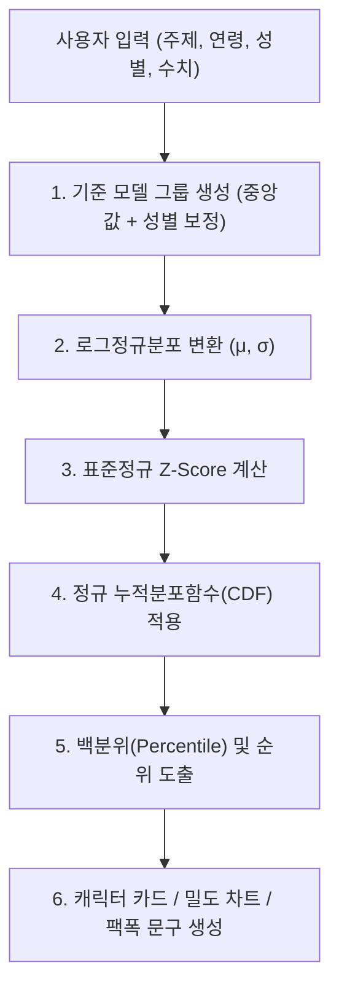

# 📊 평균인간(ko-avg-human) 코드 구조 및 통계 로직 분석 보고서

본 문서는 `ko-avg-human` 프로젝트의 입력 흐름, 백분위/통계 산출 알고리즘, 시각화 메커니즘 및 통계적 정확성과 한계점을 분석하여 정리한 문서입니다.

---

## 1. 사용자의 입력 방식 (Input Structure)

사용자는 테스트 진행 시 총 **4단계의 입력 요소**를 거치게 됩니다.

| 입력 항목 | 코드 내 타입 / 필드 | 선택 가능한 값 / 범위 | 비고 |
| :--- | :--- | :--- | :--- |
| **1. 주제(Topic) 선택** | `TOPICS` (`src/topics.ts`) | • 순자산 위치 (`net_worth`) • 연애 횟수 (`dating_count`) • 세전 연봉 (`income_salary`) • 이상형 희소성 (`ideal_match`) • 결혼시장 희소성 (`marriage_rarity`) • 월 소비 수준 (`spending_style`) | 6가지 주제 중 1개 선택 |
| **2. 연령대(Age)** | `AgeBucket` (`src/stats.ts`) | `10s`, `20s`, `30s`, `40s`, `50s`, `60+` | 만 나이 기준 6개 구간 |
| **3. 성별(Gender)** | `Gender` (`src/stats.ts`) | `female` (여성), `male` (남성), `none` (선택 안 함) | 성별별 보정치 적용 여부 결정 |
| **4. 본인의 수치(Value)** | `number` (슬라이더) | • 자산: 0 ~ 10억 원 (기본 8,000만) • 연봉: 1,500만 ~ 2억 원 (기본 4,200만) • 소비: 30만 ~ 1,000만 원 (기본 150만) • 연애: 0 ~ 20회 (기본 3회) • 이상형/결혼: 10 ~ 100점 | 주제별 단위, min/max/step에 맞춰 실시간 조절 |

---

## 2. 입력에 따른 결과 산출 로직 (Calculation Pipeline)

결과는 `src/stats.ts`의 `groupModel()`과 `computeResult()` 함수를 통해 실시간으로 계산됩니다.

### ① 그룹 중앙값(Median) 및 모수 산출
선택한 연령대의 기본 중앙값에 성별 보정값을 더합니다.
$$\text{median} = \text{medianByAge}[\text{age}] + \text{genderAdjust}[\text{gender}][\text{age}]$$
- **로그정규분포의 위치 모수**: $\mu = \ln(\text{median})$
- **척도 모수(표준편차)**: $\sigma = \text{topic.sigma}$ (주제별 고정값: 자산 0.9, 연봉 0.45, 소비 0.5 등)

### ② Z-Score 및 백분위수(Percentile) 계산
입력값 $x$가 0에 가까워 로그가 발산하는 것을 방지하기 위해 하한값(`floor`)을 적용한 뒤 Z-score를 산출합니다.
$$Z = \frac{\ln(\max(x, \text{floor})) - \mu}{\sigma}$$

이후 **Abramowitz & Stegun (7.1.26) 정밀 근사 공식**을 통해 표준정규분포 누적확률 $\Phi(Z)$를 구합니다.
- **하위 백분위(Percentile)**: $\text{percentile} = \text{clamp}(\Phi(Z) \times 100, 0.5, 99.5)$
- **상위 백분위(Top %)**: $\text{topPercent} = 100 - \text{percentile}$
- **100명 중 나보다 아래인 사람 수**: $\text{peopleBelow} = \text{round}(\text{percentile})$
- **평균과의 차이 및 비율**: $\text{diff} = x - \text{median}$, $\text{ratio} = \frac{x}{\text{median}}$

### ③ 결과 렌더링 및 시각화 매핑
1. **유형 분류**: `topPercent` 구간에 따라 3가지 캐릭터(상위 10~15%, 상위 45~50%, 그 외)와 뱃지 매핑 (`src/topics.ts`)
2. **SVG 확률밀도함수(PDF) 곡선 생성**: `densityCurve()` 함수로 곡선 좌표 120~140개를 생성하고, 사용자 위치까지의 면적을 채워 시각화 (`src/DistributionChart.tsx`)
3. **종합 리포트 텍스트**: `src/copy.ts`를 통해 타자 치는 효과(Typewriter)로 맞춤형 코멘트 출력

---

## 3. 통계적 정확성 및 타당성 분석

### ✅ 통계적 강점 (정확하고 적절한 부분)
1. **로그정규분포(Lognormal Distribution)의 적절한 채택**
   - 소득, 자산, 지출과 같은 경제 데이터는 좌우대칭인 정규분포가 아닌 **오른쪽으로 긴 꼬리를 갖는 비대칭 왜도(Right-skewed) 분포**를 띱니다.
   - 이를 로그 변환하여 모델링한 것은 **계량경제학 및 소득분포 통계에서 널리 쓰이는 표준적이고 타당한 방법**입니다.
2. **고정밀 정규누적분포(CDF) 근사 알고리즘 사용**
   - `src/stats.ts`의 `normalCdf()`는 통계 수치해석의 표준인 *Abramowitz & Stegun (Formula 7.1.26)* 방식을 채택하여 **오차가 $1.5 \times 10^{-7}$ 이하**로 매우 정밀합니다.
3. **연령별 실측 통계 경향 반영**
   - 20대~50대 연령 구간별 중앙값(20대 연봉 약 3,300만, 30대 4,800만 / 20대 자산 3,500만, 30대 1.2억 등)은 **통계청 '가계금융복지조사' 및 고용노동부 '임금직무정보시스템'의 실제 추세를 충실히 반영**하고 있습니다.

### ⚠️ 단순화 및 통계적 한계점
1. **단일 $\sigma$(표준편차) 가정**
   - 실제 현실에서는 20대보다 40~50대로 갈수록 자산/소득의 양극화($\sigma$)가 훨씬 커집니다. 하지만 코드에서는 연령별로 동일한 $\sigma$를 적용하여 단순화했습니다.
2. **부채/음수 자산 처리의 한계**
   - 순자산이 마이너스(순부채 상태)인 경우, 로그 함수 특성상 $\ln(\le 0)$ 계산이 불가능하여 `floor: 100`(100만 원)으로 보정됩니다. 따라서 빚이 많은 구간의 미세한 순위 구분은 생략됩니다.
3. **심리/주관적 지표의 오락성 성격**
   - '이상형 희소성'이나 '결혼시장 희소성'은 국가 공인 모집단 통계가 없으므로, **정규분포를 가정한 가상의 지수 모델(엔터테인먼트/바이럴용)**로 동작합니다.

---

## 4. 결론 요약
- **구현 완성도**: 정밀한 CDF 수치해석 알고리즘과 로그정규분포 수식을 활용해 **수학적으로 매우 매끄럽고 일관된 백분위 계산**을 수행합니다.
- **통계적 신뢰도**: **연봉/순자산/소비** 부문은 실제 국가 통계의 중위값 경향을 반영하여 **실제 체감과 매우 유사한 팩폭 결과**를 제공하며, **연애/결혼/이상형** 부문은 사용자 참여를 유도하는 **심리테스트형 가중 모델**로 구성되어 있습니다.
